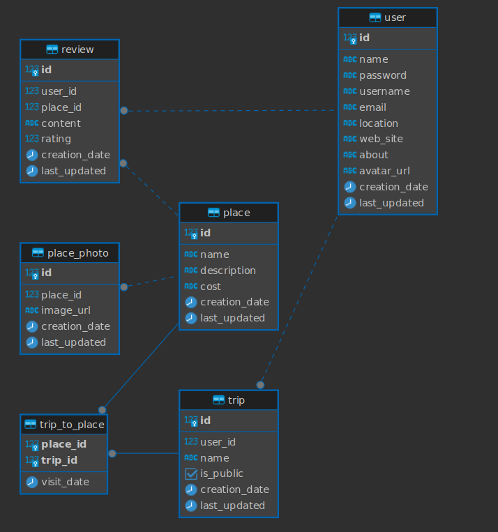

#Relation Users:

{id, username, email} -> name, location, web_site, about, avatar_url, creation_date, last_updated

Таблица с пользователями.

#Relation Reviews:

{id} -> user_id, place_id, content, rating, creation_date, last_updated

Таблица с отзывами.

#Relation Places:

{id} -> name, description, cost, image_url, creation_date, last_updated

Таблица с достопримечательностями.

#Relation Trips:

{id} -> user_id, name, is_public, creation_date, last_updated

Таблица с поездками.

#Relation Trips_to_places:

{id} -> place_id, trip_id

Таблица для отношения многие ко многим между поездками и достопримечательностями.

#Нормальные формы

- 1ая нормальная форма:
Каждая таблица содержит только 1 значение для каждого атрибута из кортежа.

- 2ая нормальная форма:
Нет ни одной функциональной зависимости от части ключа.

- 3ья нормальная форма:
Нет ни одной функциональной зависимости от неключевых атрибутов.

- Нормальная форма Бойса — Кодда:
Все функциональные зависимости имеют в качестве детерминанты потенциальные ключи.

#ERD

